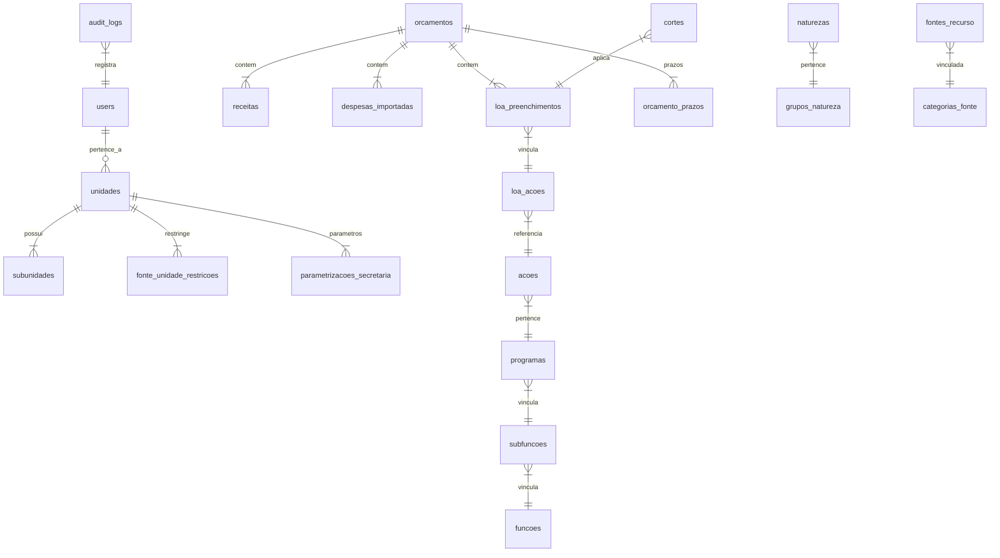
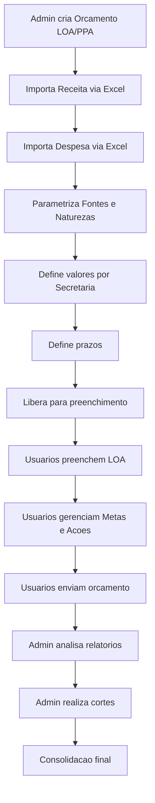

# Arquitetura Inicial - SIPO

## Stack Tecnologica

- **Backend**: Laravel 11 (PHP 8.2+)
- **Frontend**: Livewire 3 + Alpine.js + Tailwind CSS 3
- **Banco de Dados**: MySQL 8.0+
- **Importacao Excel**: Laravel Excel (maatwebsite/excel)
- **PDF/Relatorios**: DomPDF ou Snappy
- **Autenticacao**: Laravel Breeze (simplificado) ou Jetstream
- **Auditoria**: owen-it/laravel-auditing
- **Servidor**: Apache (ja disponivel em /var/www/html)

---

## Perfis de Usuario


| Perfil            | Descricao                                                                                                    |
| ----------------- | ------------------------------------------------------------------------------------------------------------ |
| **Administrador** | Secretaria de Planejamento. Cria orcamentos, importa dados, parametriza, faz cortes, gera relatorios globais |
| **Usuario**       | Secretarias municipais. Preenche LOA, gerencia metas/acoes, envia orcamento, gera relatorios da sua unidade  |


---

## Dados Reais do Municipio (extraidos das planilhas)

Os arquivos em `Documentos/` fornecem os dados concretos do municipio que servem como seeders e definem a estrutura:

- `**ESTRUTURA DAS DESPESAS.xlsx`** (1.320 linhas): Estrutura completa das despesas 2026. Colunas: Ano, Despesa (nro sequencial), Natureza, Fonte, Unidade, Descricao Unidade, Subunidade, Descricao Subunidade, Programa, Descricao Programa, Acao, Descricao Acao. Contem 28 unidades, 31 subunidades, 45 programas, 257 acoes, 46 naturezas e 28 fontes.
- `**informacoes.xlsx`** (aba "Informacoes"): Duas tabelas de referencia lado a lado:
  - **Naturezas de Despesa**: codigo (8 digitos, ex: 31901100), descricao, classificacao (Pessoal / Outras Despesas / Outros Investimentos / Obras / Terceirizacao / Reserva / Amortizacao / Juros e Encargos / Imoveis), codigo do grupo (2 primeiros digitos: 31, 33, 44, 46, 99)
  - **Fontes de Recurso**: codigo (4 digitos, ex: 1500), descricao, recurso vinculado a (RECURSOS LIVRES / VINCULADOS A EDUCACAO / SAUDE / ASSISTENCIA SOCIAL / DEMAIS VINCULACOES / PREVIDENCIA SOCIAL / etc.)
- `**1 - Receita.xlsx`**: Formato de importacao de receita com: Natureza da Receita, Descricao, Fonte de Recurso, Valor
- `**2.A - Saldo da Despesa.xlsx`** (763 linhas): Historico com campos extras: Valor Inicial, Empenhado, Liquidado
- `**2.B - Descricao das Despesas.xlsx`** (406 linhas): Despesas com nome da Secretaria
- `**2.C - Descricao da Natureza e Fonte.xlsx`**: Tabela de de-para natureza/fonte

### Fontes que Iniciam com "2" (precisam substituicao automatica na importacao)

- 2500 -> 1500, 2501 -> 1501, 2660 -> 1660, 2661 -> 1661, 2700 -> 1700, 2703 -> 1703, 2708 -> 1708

### Classificacoes de Natureza (do `informacoes.xlsx`)

A classificacao da natureza vem do campo `classificacao` na planilha e determina automaticamente se uma despesa e de Pessoal, Custeio (Outras Despesas), Investimento, Terceirizacao, etc. O grupo e derivado dos 2 primeiros digitos do codigo da natureza (31=Pessoal, 33=Outras Despesas, 44=Investimentos, 99=Reserva).

### Vinculacao de Fontes (do `informacoes.xlsx`)

Cada fonte possui o campo `recurso_vinculado` que indica a area vinculada:

- RECURSOS LIVRES (1500, 1501, 1502, 1503)
- VINCULADOS A EDUCACAO (1540-1599)
- VINCULADOS A SAUDE (1600-1659)
- VINCULADOS A ASSISTENCIA SOCIAL (1660-1669)
- DEMAIS VINCULACOES DE TRANSFERENCIAS (1700-1749)
- DEMAIS VINCULACOES LEGAIS (1750-1799)
- PREVIDENCIA SOCIAL (1800-1804)

---

## Modelo de Dados (Banco MySQL)




### Tabelas Principais

**Autenticacao e Usuarios**

- `users`: id, name, email, phone, password, role (admin/usuario), unidade_id, nome_secretario, active

**Estrutura Organizacional**

- `unidades`: id, codigo, descricao (ex: 7 - SECRETARIA MUNICIPAL DE EDUCACAO). Seedar com as 28 unidades reais.
- `subunidades`: id, unidade_id, codigo, descricao (ex: Unidade 7 -> Sub 1 FUNDEB, Sub 2 SEC. EDUCACAO). Seedar com as 31 subunidades reais.

**Classificacao Orcamentaria**

- `funcoes`: id, codigo, descricao (nao esta na ESTRUTURA DAS DESPESAS mas e derivada dos programas - extrair do 2.A/2.B)
- `subfuncoes`: id, funcao_id, codigo, descricao
- `programas`: id, codigo, descricao (seedar com os 45 programas reais, ex: 301 - Atencao Basica)
- `acoes`: id, programa_id, unidade_id, subunidade_id, codigo, descricao, tipo_acao (1=Obras, 2=Atividade, 0=Op.Especiais). Seedar com as 257 acoes reais.
- `naturezas`: id, codigo (formato 3.1.90.11.00.00.00), codigo_compacto (31901100), descricao, classificacao (Pessoal/Outras Despesas/Outros Investimentos/Obras/Terceirizacao/Reserva/Amortizacao/Juros e Encargos/Imoveis), grupo (2 primeiros digitos: 31, 33, 44, 99). Seedar com as 46+ naturezas do `informacoes.xlsx`.
- `fontes_recurso`: id, codigo, descricao, recurso_vinculado (RECURSOS LIVRES/VINCULADOS A EDUCACAO/SAUDE/etc). Seedar com as 80+ fontes do `informacoes.xlsx`.

**Orcamento**

- `orcamentos`: id, ano, tipo (LOA/PPA), status (aberto/finalizado), periodo_ppa_inicio, periodo_ppa_fim, prazo_preenchimento, created_by
- `orcamento_prazos`: id, orcamento_id, unidade_id, prazo_estendido (prazo especifico por secretaria)

**Receita**

- `receitas`: id, orcamento_id, natureza_receita, descricao, fonte_recurso, valor, eh_deducao, percentual_projecao, valor_projetado

**Despesa Importada** (formato da ESTRUTURA DAS DESPESAS.xlsx)

- `despesas_importadas`: id, orcamento_id, ano, numero_despesa, natureza_id, fonte_id, unidade_id, subunidade_id, programa_id, acao_id, valor_inicial, empenhado, liquidado

**Parametrizacao**

- `regras_fonte`: id, orcamento_id, fonte_origem, fonte_destino (ex: 2500 -> 1500). Pre-populado com as 7 substituicoes conhecidas.
- `fonte_unidade_restricoes`: id, orcamento_id, fonte_recurso_inicio, fonte_recurso_fim, unidade_id, subunidade_id (ex: fontes 540-599 restritas a unidade 7)
- `parametrizacoes_secretaria`: id, orcamento_id, unidade_id, subunidade_id, fonte_id, classificacao (custeio/pessoal/investimento/terceirizacao), percentual_anterior, valor_liberado
- `regras_percentual`: id, orcamento_id, descricao, fonte_id, unidade_id, percentual, tipo (obrigatorio/referencia)

**Preenchimento LOA**

- `loa_preenchimentos`: id, orcamento_id, unidade_id, subunidade_id, acao_id, natureza_id, fonte_id, detalhamento, valor (inteiro, sem centavos), observacao
- `loa_acoes`: id, orcamento_id, unidade_id, subunidade_id, acao_original_id, tipo_acao, nome, status (ativa/excluida/nova/editada), nome_anterior
- `envios_orcamento`: id, orcamento_id, unidade_id, status (rascunho/enviado), enviado_em, user_id

**Cortes**

- `cortes`: id, orcamento_id, loa_preenchimento_id, valor_original, valor_cortado, justificativa, admin_id, created_at

**Auditoria**

- `audit_logs`: id, user_id, auditable_type, auditable_id, event (create/update/delete), old_values, new_values, ip_address, created_at

---

## Estrutura de Modulos (Laravel)

```
app/
  Models/           -- Eloquent models para cada tabela
  Http/
    Controllers/    -- Controllers de rotas (minimo, Livewire faz o grosso)
    Middleware/
      EnsureAdmin.php
      EnsureOrcamentoAberto.php
    Requests/       -- Form Requests de validacao
  Livewire/
    Admin/
      Dashboard.php
      CriarUsuario.php
      NovoOrcamento/
        ImportarReceita.php
        ImportarDespesa.php
        ParametrizacaoFonte.php
        ParametrizacaoNatureza.php
        ParametrizacaoValores.php
        ParametrizacaoSecretaria.php
        ParametrizacaoPrazos.php
      Cortes/
        GerenciarCortes.php
      Relatorios/
        EvolucaoPreenchimento.php
        DiferencaValores.php
        ImprimirOrcamento.php
    Usuario/
      Dashboard.php
      PreencherLoa.php
      MetasAcoes.php
      Obras.php
      EnviarOrcamento.php
      Relatorios/
        MeusRelatorios.php
  Services/
    ImportacaoReceitaService.php
    ImportacaoDespesaService.php
    ParametrizacaoService.php
    LoaService.php
    CorteService.php
    RelatorioService.php
  Imports/          -- Classes maatwebsite/excel
    ReceitaImport.php
    DespesaImport.php
  Exports/
    OrcamentoExport.php
  Policies/         -- Authorization policies
  Rules/            -- Custom validation rules (ex: ValorInteiroRule)
```

---

## Fluxo Principal do Sistema




---

## Regras de Negocio Criticas

Estas regras devem ser implementadas como **Services** e **Validation Rules**:

**Importacao e Substituicao de Fontes**

1. Fontes iniciando com "2" sao substituidas por "1" na importacao. Casos reais encontrados: 2500->1500, 2501->1501, 2660->1660, 2661->1661, 2700->1700, 2703->1703, 2708->1708
2. Apos substituicao, eliminar naturezas com fontes duplicadas na mesma acao

**Restricao de Fontes por Secretaria (via `fonte_unidade_restricoes`)**
3. Fontes 1540-1599: apenas para Educacao (unidade 7)
4. Fontes 1600-1659: apenas para Saude (unidade 6)
5. Fontes 1660-1669: apenas para Assistencia Social (unidades 9, 12, 13, 22, 26)
6. Fontes 1540 e 1543: exclusivas para subunidade FUNDEB (sub 1 da unidade 7)
7. Demais fontes (RECURSOS LIVRES, DEMAIS VINCULACOES): visiveis para todas as secretarias

**Classificacao Automatica de Despesas (via campo `classificacao` da natureza)**
8. A classificacao (Pessoal/Custeio/Investimento/Terceirizacao) e determinada automaticamente pelo codigo da natureza usando a tabela do `informacoes.xlsx`. Grupo 31=Pessoal, 33=Outras Despesas(Custeio), 44=Investimentos, etc.

**Percentuais Obrigatorios**
9. 15% fonte 1500 -> Saude, 25% fonte 1500 -> Educacao
10. 15% receita CFEM -> Fundo de Desenvolvimento Economico (unidade 17, sub 1)

**Validacoes de Preenchimento**
11. Apenas valores inteiros (sem centavos). Validacao `integer` em todos os campos monetarios
12. Natureza+Fonte unica por acao (nao permitir duplicatas)
13. Fontes no dropdown filtradas conforme restricoes da secretaria/subunidade do usuario
14. Detalhamento de fonte: apenas para Saude e Educacao

**Gestao de Acoes**
15. Acoes excluidas: soft delete com sinalizacao vermelha em Metas e Acoes, ocultadas na tabela de preenchimento
16. Acoes novas: codigo em branco (gerado posteriormente pelo GOVBR), sinalizacao visual "NOVA ACAO"
17. Acoes editadas: registrar nome anterior, sinalizar que houve alteracao

---

## Rotas Principais

```
/login
/admin/dashboard
/admin/usuarios/criar
/admin/orcamento/novo
/admin/orcamento/{id}/importar-receita
/admin/orcamento/{id}/importar-despesa
/admin/orcamento/{id}/parametrizacao
/admin/orcamento/{id}/cortes
/admin/relatorios
/usuario/dashboard          -- mostra LOA aberta, totais, %
/usuario/loa/{id}/preencher
/usuario/loa/{id}/metas-acoes
/usuario/loa/{id}/obras
/usuario/loa/{id}/enviar
/usuario/relatorios
```

---

## Pacotes Laravel Essenciais

- `laravel/breeze` -- autenticacao
- `maatwebsite/excel` -- importacao/exportacao Excel
- `barryvdh/laravel-dompdf` -- geracao de PDF
- `owen-it/laravel-auditing` -- log de auditoria automatico
- `livewire/livewire` -- componentes reativos
- `spatie/laravel-permission` -- controle de permissoes por role
- `wire-elements/modal` -- modais Livewire (para formularios de acao, parametrizacao)

---

## Seeders Iniciais (dados reais do municipio)

Na Fase 2, os seeders devem importar diretamente dos arquivos Excel em `Documentos/`:

- **UnidadeSeeder**: 28 unidades (codigos 1 a 26 + Camara codigos 1 e 2)
- **SubunidadeSeeder**: 31 subunidades vinculadas as unidades
- **ProgramaSeeder**: 45 programas (codigos 31 a 999)
- **AcaoSeeder**: 257 acoes vinculadas a programas, unidades e subunidades
- **NaturezaSeeder**: 46+ naturezas com classificacao e grupo (do `informacoes.xlsx`)
- **FonteRecursoSeeder**: 80+ fontes com descricao e recurso vinculado (do `informacoes.xlsx`)
- **RegraFonteSeeder**: 7 regras de substituicao de fonte (2xxx -> 1xxx)
- **FonteUnidadeRestricaoSeeder**: restricoes de fontes por secretaria

## Proximos Passos para Implementacao

A implementacao sera feita em fases incrementais, comecando pela base e avancando para os modulos de negocio.